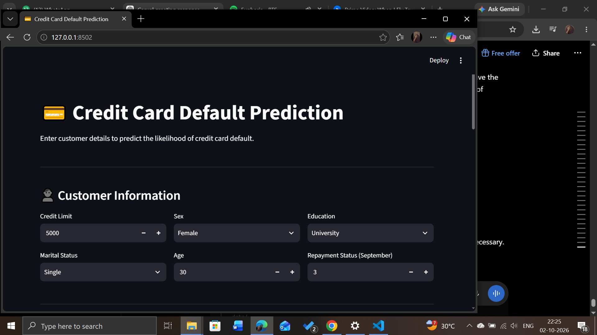
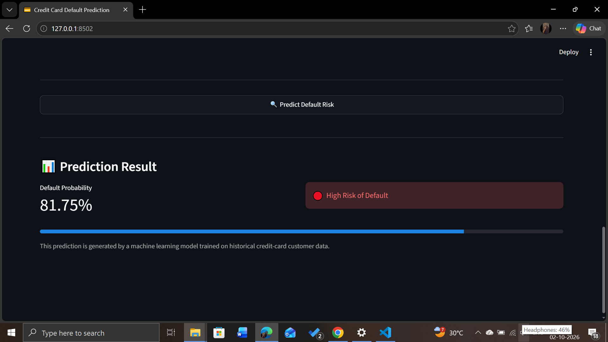

# 💳 Credit Card Default Prediction

A machine learning project that predicts the likelihood of a customer defaulting on their credit card payment based on demographic, credit limit, repayment status, billing, and payment information.

## 📌 Project Overview

Credit card default prediction can help financial institutions identify customers who may be at risk of defaulting on their upcoming payment.

This project uses multiple machine learning classification algorithms and compares their performance using accuracy, precision, recall, and F1-score.

A Streamlit web application is also provided to make predictions through an interactive user interface.

## 🎯 Objectives

- Analyze credit card customer data
- Perform exploratory data analysis
- Preprocess the dataset for machine learning
- Train and compare multiple classification models
- Handle class imbalance using class-weighted models
- Evaluate models using multiple performance metrics
- Build an interactive prediction application using Streamlit

## 📊 Dataset

The project uses the **Default of Credit Card Clients** dataset from the UCI Machine Learning Repository.

- Records: 30,000
- Features used: 23
- Target: Default payment next month
- Target classes:
  - `0` → No default
  - `1` → Default

## 🔍 Exploratory Data Analysis

The project analyzes:

- Default vs non-default distribution
- Age distribution
- Credit limit distribution
- Default rate by education level
- Default rate based on recent repayment status

## 🤖 Machine Learning Models

The following classification models were evaluated:

1. Logistic Regression
2. Decision Tree
3. Random Forest
4. Balanced Decision Tree
5. Balanced Random Forest

Because the dataset contains fewer default cases than non-default cases, accuracy alone was not used to evaluate the models.

The models were compared using:

- Accuracy
- Precision
- Recall
- F1-score
- Confusion Matrix

## 🏆 Selected Model

The **Balanced Random Forest** model was selected for the application because it achieved the highest recall and F1-score among the evaluated models.

### Performance

| Metric | Score |
|---|---:|
| Accuracy | 77.93% |
| Precision | 50.09% |
| Recall | 59.76% |
| F1-score | 54.50% |

The emphasis on recall helps the application identify a larger proportion of customers who belong to the default class.

## 🖥️ Streamlit Application

The project includes an interactive Streamlit web application where users can enter customer information such as:

- Credit limit
- Gender
- Education
- Marital status
- Age
- Repayment status
- Billing amounts
- Payment amounts

The application returns a predicted probability of default and a corresponding risk indication.
### Application Preview

#### Customer Information



#### Prediction Result



## 🛠️ Technologies Used

- Python
- Pandas
- NumPy
- Matplotlib
- Seaborn
- Scikit-learn
- Streamlit
- Joblib

## 📁 Project Structure

```text
credit-card-default-prediction/
│
├── data/
│   └── credit_card_default.xls
│
├── model/
│   └── credit_card_default_model.pkl
│
├── app.py
├── train_model.py
├── test_app.py
├── requirements.txt
└── README.md
